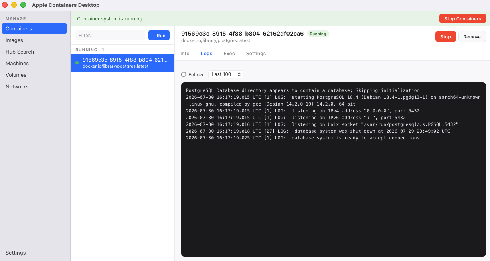

# Apple Containers Desktop

[](https://github.com/joeshirey/AppleContainerDesktop/actions/workflows/ci.yml)

A native macOS desktop GUI for [Apple's `container`](https://github.com/apple/container) CLI.

`container` is a good tool with no graphical front end. This puts one on top of it: a
sidebar of your containers, images, VMs, volumes, and networks, with logs, a shell, and
an editable settings panel behind each one. It shells out to the `container` binary you already have installed
and parses its JSON output — there is no daemon, no socket, and no second source of truth.
Anything you do here you could have done at the prompt.



> **Early version — build it and run it yourself.**
> This is developer-oriented software at version 0.1. There are no prebuilt downloads and
> no release binaries; the [supported path](#build-and-run-it-locally) is cloning the repo
> and building it. Expect rough edges — the [Known gaps](#known-gaps) section is an honest
> list of them. It is useful day to day, but it has not been hardened, packaged, or tested
> anywhere beyond the machines of the people working on it.

## Requirements

| | |
|---|---|
| **Mac** | Apple silicon. Required — `container` does not run on Intel. |
| **macOS** | 26 or later. Apple does not support `container` on older versions. |
| **`container` CLI** | Installed and on disk. Developed against 1.2.0. |
| **To build** | Node.js 20+, and a Rust toolchain via [rustup](https://rustup.rs). |

Install the CLI from [apple/container releases](https://github.com/apple/container/releases),
then start the service once:

```sh
container system start
```

The app looks for the binary at `/opt/homebrew/bin/container`, then `/usr/local/bin/container`,
then falls back to a plain `PATH` lookup. It probes those two paths explicitly because a Mac
app launched from Finder or the Dock inherits a minimal `PATH` that usually does not include
Homebrew.

## Build and run it locally

This is the intended way to use the app.

**One-time setup.** Install [Node.js](https://nodejs.org) 20 or newer and a Rust toolchain:

```sh
curl --proto '=https' --tlsv1.2 -sSf https://sh.rustup.rs | sh
```

Xcode Command Line Tools are also needed for linking; `xcode-select --install` if you
have not already. Then:

```sh
git clone https://github.com/joeshirey/AppleContainerDesktop.git
cd AppleContainerDesktop
npm install
```

**Run it.** Two ways, depending on what you're doing:

```sh
npm run tauri dev
```

Development mode. Opens the app with hot reload — edit anything under `src/` and the
window updates without restarting. Right-click → Inspect Element gives you a devtools
console. The first launch compiles the Rust side and takes a couple of minutes; later
ones are seconds. This is what you want if you're changing the code.

```sh
npm run tauri build
```

Release mode. Compiles an optimized build and packages it, taking a minute or so from
cold. It writes two things to `src-tauri/target/release/bundle/`:

| Path | What it is |
|---|---|
| `macos/Apple Containers Desktop.app` | The application. Double-click it, or drag it to `/Applications`. |
| `dmg/Apple Containers Desktop_0.1.0_aarch64.dmg` | A ~4 MB disk image wrapping that same `.app`. |

To use it like a normal app:

```sh
cp -r "src-tauri/target/release/bundle/macos/Apple Containers Desktop.app" /Applications/
open "/Applications/Apple Containers Desktop.app"
```

That works on the machine that built it, which is the supported case. Moving that `.app`
to *another* Mac is where it gets complicated — see below.

**If the app opens but shows no containers,** the `container` binary was not found. The app
looks in `/opt/homebrew/bin`, then `/usr/local/bin`, then `PATH`. Check with
`which container`; if it lives somewhere else, symlink it into one of those two.

## A note on distributing it

**Short version: don't bother. Build locally.** This section exists to explain why, and
what it would take if you ever wanted to change that.

`tauri build` does emit a real `.dmg`, so it looks like something you could hand to a
colleague. You can't, quite. The bundle is *ad-hoc signed* — it carries a signature but no
Apple team identity — so Gatekeeper rejects it anywhere but the machine that produced it:

```
$ spctl -a -t install "Apple Containers Desktop.app"
Apple Containers Desktop.app: code has no resources but signature indicates they must be present
```

Someone who downloads that file is told the app is damaged or comes from an unidentified
developer. There are workarounds — right-click → Open, or
`xattr -dr com.apple.quarantine "/Applications/Apple Containers Desktop.app"` — but talking
strangers through stripping quarantine flags off a binary is a bad habit to teach, and most
will just delete it.

Making it genuinely distributable needs three things:

1. **An Apple Developer Program membership**, $99/year. The free tier signs for local
   development but cannot notarize, so downloads still show as unverified.
2. **A Developer ID Application certificate** — only the account holder can create one. Set
   it via `APPLE_SIGNING_IDENTITY` or `bundle.macOS.signingIdentity` in `tauri.conf.json`.
3. **Notarization**, which submits the signed bundle to Apple for an automated malware scan
   and staples the result to it. Driven by either the App Store Connect API
   (`APPLE_API_ISSUER`, `APPLE_API_KEY`, `APPLE_API_KEY_PATH`) or an Apple ID (`APPLE_ID`,
   `APPLE_PASSWORD` as an app-specific password, `APPLE_TEAM_ID`).

With those in the environment, `npm run tauri build` signs and notarizes as part of the
build, and [`tauri-action`](https://github.com/tauri-apps/tauri-action) does it in GitHub
Actions so that tagging a version publishes an installable `.dmg`. Tauri's
[macOS signing guide](https://v2.tauri.app/distribute/sign/macos/) walks the full path.

None of that is set up here, and given that everyone who can run this already needs the
`container` CLI installed from a GitHub release, building from source is a reasonable ask.

## What's in it

**Containers** — running and stopped, grouped, with a list that refreshes on an interval.
Select one for four tabs:

- **Info** — image, status, ID, and published ports, plus live CPU and memory readings
  while the container is running.
- **Logs** — the last 100/500/1000 lines, configurable.
- **Exec** — a shell prompt against the container. Commands run through `sh -c`, so pipes,
  redirects, globs, and `&&` all work. Each command is independent, so `cd` does not persist
  between them.
- **Settings** — edit CPUs, memory, ports, and environment variables. Because `container`
  has no `update` command, applying a change removes and re-runs the container. The panel
  rebuilds the *entire* `container run` invocation from the container's own inspect output,
  so mounts, labels, networks, entrypoint, workdir, user, capabilities, and DNS all survive.
  It shows the exact command and a diff before touching anything, warns about the few
  settings `run` has no flag for, and if the re-run fails after the remove, hands you the
  full command line to recover with.

A container whose bind-mount source has been deleted off the host gets a **mount missing**
badge in the list and a banner in its detail panel naming the paths. It won't start until
they're restored, but it stays visible, inspectable, and removable.

**+ Run** opens a dialog for image, name, ports, env vars, CPUs, and memory.

**Images** — list, run, remove, prune unused, and pull by name. Names are shortened the
way the CLI shortens them, so a Docker Hub image reads as `debian` rather than
`docker.io/library/debian`; every action still uses the fully qualified reference. Sizes
are the compressed download size of the arm64 variant, the only real figure the CLI's
metadata records — the unpacked footprint on disk is larger.

**Build Image…** opens a form for building from a Dockerfile; output streams into the
modal live, and closing it leaves the build running. While a build is in flight, a strip
appears in the view; click it to reopen the output.

**Builder** — image builds run inside a builder container that is separate from the main
container system. This view shows its status (running, stopped, or not created) and its
CPU and memory allocation, and lets you start it with optional CPUs and memory, stop it,
or delete it (confirm required).

**Docker Hub** — search Hub without leaving the app; official images are badged and sorted
first, then by pull count. Pick a tag and pull it. Results that can't actually be pulled
here — Hardened Images, which need a subscription, and Docker Desktop extensions — are
filtered out, as are archived repositories.

**Machines** — *container machines*, which are a separate feature from containers and are
worth explaining, because the name suggests something they are not.

A container machine is a long-lived Linux VM built from a container image. You create one
from something like `alpine:3.22`, it boots, your home directory is mounted into it (`rw`
by default), and you can open a shell and treat it as a persistent Linux box on your Mac.
Containers are the opposite: disposable, isolated, running one image's command.

They are **not** required to run containers. `container run` does not consult them, and if
you have never created one this tab will be empty while everything else works — which is
the normal state. Think of it as "give me a Linux VM," offered by the same tool, rather
than as infrastructure that containers sit on.

The tab lists any machines you have with their CPU, memory, and state, and can create,
stop, delete, and set the default machine. Selecting one gives it four tabs:

- **Info** — CPUs and memory.
- **Logs** — the machine's stdio log, with a **Boot log** toggle for the VM's boot output,
  which is where you look when a machine won't come up.
- **Shell** — a prompt inside the machine, via `container machine run`. The machine is
  booted first if it is stopped. Unlike the container Exec tab, nothing wraps the command
  in `sh -c` — `machine run` evaluates it in a shell on the far side already, so pipes,
  globs, and quoting work as typed.
- **Settings** — CPUs, memory, and how your home directory is mounted (`rw`, `ro`, `none`),
  via `container machine set`. Only fields you change are sent. The CLI reads these at boot,
  so the panel says plainly that the machine has to be restarted before they take effect.

**Volumes** — create, delete, and prune, with two size columns rather than one.
`container volume ls` reports a single `sizeInBytes`, and it is the sparse image's
provisioned ceiling: a 512 GB volume holding a small database reads as 512 GB while
occupying a few hundred MB. The table shows that ceiling next to the blocks actually
allocated, so **On disk** is the number that answers "what is this costing me". Each
volume also lists the containers mounting it; the CLI refuses to delete a mounted
volume, so Delete is disabled there rather than offered and then failing.

> Pruning volumes destroys their contents, not just their bookkeeping. The button
> says so before it does anything.

**Networks** — create, delete, and prune, showing each network's subnet, gateway, and
mode, plus the containers attached to it. A new network can take a subnet and can be
made host-only (`--internal`), which shows up afterwards as mode `hostOnly`. The
`default` network is marked **Built-in** and has no Delete button at all, because
`container network delete default` fails outright.

**Settings** — poll interval and default log line count, persisted to `.settings.json`.

A banner across the top reports whether the container system is running and offers to start
or stop it.

## Development

```sh
npm test                    # 182 frontend tests (Vitest + Testing Library)
npm run test:watch
npm run build               # tsc + vite, the typecheck gate
cd src-tauri
cargo fmt --check
cargo clippy --all-targets --locked -- -D warnings
cargo test --locked         # 63 Rust tests
cargo build --locked
```

All of these run in CI on every push and pull request — see
[.github/workflows/ci.yml](.github/workflows/ci.yml). The job uses `macos-26`, the same
platform the app requires, and does *not* install the `container` CLI: no test needs it,
because the one test that shells out asserts on the error path.

The ordering matters if you run them by hand. `npm run build` has to come before any
`cargo` command, because `tauri-codegen` embeds `frontendDist` at compile time and `dist/`
is not checked in — without it the Rust build fails with *"the `frontendDist` configuration
is set to `../dist` but this path doesn't exist"*.

### Layout

```
src/
  api.ts          Typed wrappers over the Tauri IPC bridge; normalizes CLI JSON
  types.ts        Shared frontend types
  views/          Top-level screens (containers, images, hub, machines, settings)
  panels/         Detail panes and modals
  hooks/          Polling and persisted settings
src-tauri/src/
  cli.rs          Locates the binary, runs it, parses JSON, surfaces stderr
  containers.rs   The #[tauri::command] surface
  recreate.rs     Rebuilds a full `container run` line from inspect output
```

The split worth knowing: `cli.rs` is the only place that spawns a process, and `recreate.rs`
is pure — it takes inspect JSON plus edits, returns an argv, and touches nothing. That is
why it carries most of the Rust test suite.

### The icon

`app-icon.png` in the repo root is the master: 1024×1024 with real transparency, the tile
sized to 824×824 on Apple's macOS icon grid. Everything in `src-tauri/icons/` is generated
from it — replace the master and re-run:

```sh
npm run tauri icon app-icon.png
```

That also emits `ios/` and `android/` directories, which this project does not use; delete
them. The original generated artwork is kept at [docs/app-icon-source.jpg](docs/app-icon-source.jpg).

## Known gaps

Being honest about what isn't done:

- **Build secrets and non-image build output.** `--secret` and `--output type=tar|local`
  are not exposed. Everything else `container build` accepts is.
- **No registry logins.** `container registry login` is not wired up, so private
  registries only work if you have already authenticated at the prompt.
- **No file copy in or out.** `container cp` and `container export` are missing.
- **Volume and network creation is deliberately partial.** Labels, driver options, the
  network plugin, and IPv6 prefixes are all left at the CLI's defaults; the panels
  expose size, subnet, and host-only because those are the ones that change behaviour
  you can see.

## License

Apache License 2.0 — see [LICENSE](LICENSE).

This project is not affiliated with or endorsed by Apple.
